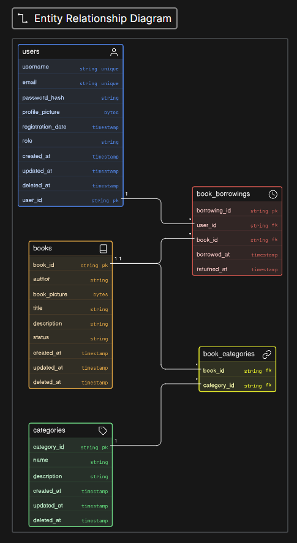

# RPLLibrary

## Table of Contents
- [ID Version](#id-version)
- [EN Version](#en-version)

---

## ID Version

### Daftar Isi
- [Tentang Proyek](#tentang-proyek)
- [Alasan Memakai Go](#alasan-memakai-go)
- [Alasan Memakai Layered Architecture](#alasan-memakai-layered-architecture)
- [Skema Database](#skema-database)
- [Cara Penggunaan](#cara-penggunaan)
- [Analisis](#analisis)
- [Dokumentasi API](#dokumentasi-api)

### Tentang Proyek
RPLLibrary adalah.. API untuk perpustakaan, dikembangkan dengan Go.

### Alasan Memakai Go
- Kena penyakit go gila 

### Alasan Memakai Layered Architecture
- Mudah dikembangkan untuk tahapan awal

### Skema Database


### Cara Penggunaan
- Setup database menggunakan `env.example`, bisa lewat Docker Compose atau pgAdmin.
- Buat database terlebih dahulu sebelum menjalankan fungsi `main`.
- Sekaligus atur konfigurasi pada `env.example`.

### Analisis
- **Keamanan**: untuk password sudah menggunakan `bcrypt` dengan hash dan salt.

```go
  bcrypt.GenerateFromPassword([]byte(req.Password), bcrypt.DefaultCost)
```

  - **Upload gambar**: endpoint untuk upload gambar dipisahkan agar lebih rapi dan terstruktur (w mas Azka).
  - **Transaksi data**: memakai `transaction` pada mutasi data (create, update, dan delete) untuk menjaga konsistensi data.

#### Fitur Filtering
  - List semua kategori 
  - Cari buku lewat kategori
  - Cari buku lewat status
  - Cari buku lewat judul

#### Catatan

  - Filter kategori menggunakan field `name` pada tabel `categories` sebagai acuan daftar buku (Biasanya memakai `id`, tapi pengen nyoba kalau pakai literal value)


### Dokumentasi API

Menggunakan Bruno, di folder `./docs/rplLibrary-docs`

-----

## EN Version

### Table of Contents

  - [About the Project](#about-the-project)
  - [Why Go](#why-go)
  - [Why Layered Architecture](#why-layered-architecture)
  - [Database Scheme](#database-scheme)
  - [How to Use](#how-to-use)
  - [Analysis](#analysis)
  - [API Documentation](#api-docs)

### About the Project

RPLLibrary is.. API for Library. Developed with Go.

### Why Go

  - Because Go is fun to use (i guess)
  - It is commonly used

### Why Layered Architecture

  - Easier to develop for the early stages of the project

### Database Scheme


### How to Use

  - Set up the database using `env.example`, either through Docker Compose or pgAdmin.
  - Create the database before running the `main` function.
  - Make sure the configuration in `env.example` is properly set.

### Analysis

  - **Security**: passwords are handled using `bcrypt` with hashing and salt.
    ```go
    bcrypt.GenerateFromPassword([]byte(req.Password), bcrypt.DefaultCost)
    ```
  - **Image upload**: the image upload endpoint is separated to keep the API structure cleaner. (w mas Azka)
  - **Data mutation**: `transaction` is used for data mutations such as create, update, and delete to maintain consistency.

#### Filtering Features
- Get all category
- Find book by category
- Find book by status
- Search by title

#### Notes

  - Category filtering uses the `name` field in the `categories` table as the reference for book listing.  ( Normally, `id` would be used, but this project uses literal values as an experiment)

### API Docs

With Bruno, at `./docs/rplLibrary-docs` folder.

